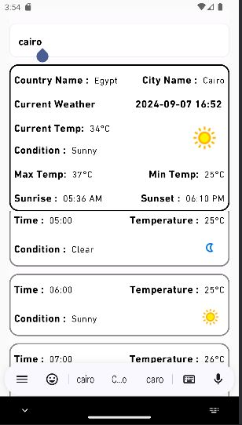

# WeatherApp
Welcome to the WeatherApp repository! This is an Android application that provides weather forecasts based on user search inputs. The app integrates various modern Android development tools and practices to deliver accurate and up-to-date weather information.

## Features

- **Real-time Weather Forecasts**: Fetch current and forecasted weather data.
- **Search Functionality**: Search for weather by city or location.
- **Modern UI**: Built with Jetpack Compose for a responsive and user-friendly interface.
- **Dependency Injection**: Utilizes Hilt for dependency injection.
- **Clean Architecture**: Follows Clean Architecture principles for a well-organized codebase.
- **Coroutines**: Uses Kotlin Coroutines for asynchronous operations and smooth performance.

## Technologies Used

- **Kotlin**: Programming language used for Android development.
- **Jetpack Compose**: Modern toolkit for building native UIs.
- **Retrofit**: HTTP client for API interactions.
- **Hilt**: Dependency injection framework.
- **Kotlin Coroutines**: For managing background threads and asynchronous tasks.

## Architecture

The application follows the Model-View-ViewModel (MVVM) architecture pattern to separate concerns and ensure a clean codebase. The primary components are:

- **MVI**: Handle the logic and interact with repositories to fetch data.
- **Repositories**: Abstract the data source and provide data to ViewModels.
- **Views**: Android Compose UI.

## Screenshots
|  |_

